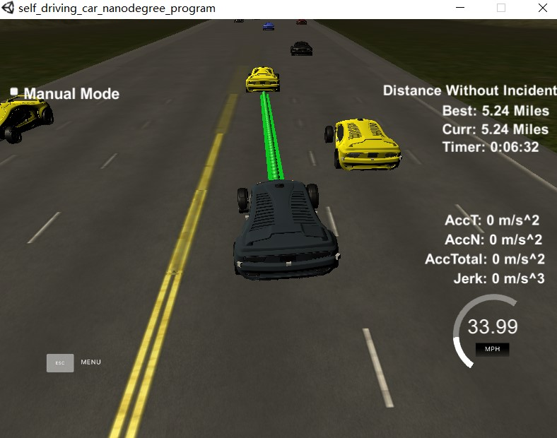
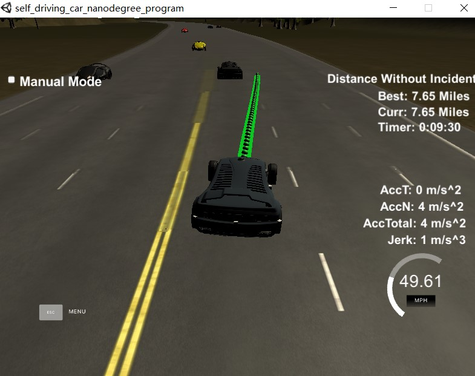
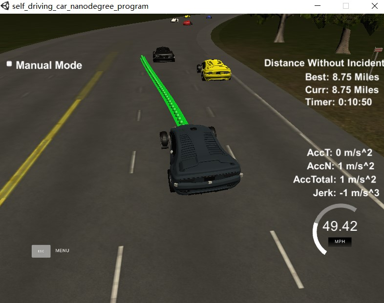
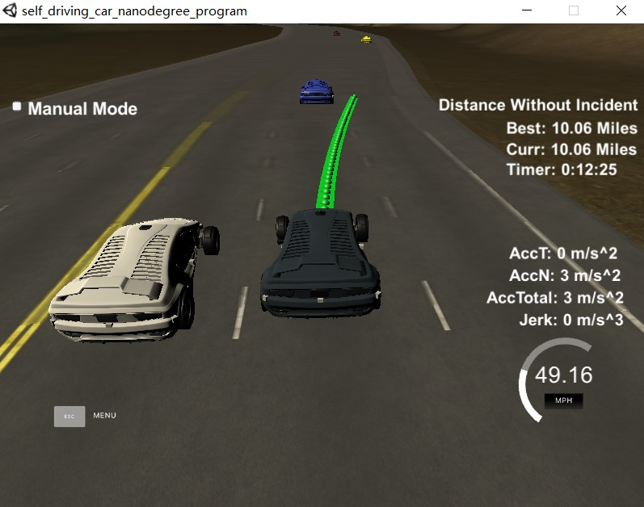

# [Rubic points](https://review.udacity.com/#!/rubrics/1020/view)
## Compilation
### The code compiles correctly.
The whole project src can be compiled correctly. A new file was added [src/spline.h](./scr/spline.h). It is the [Cubic Spline interpolation implementation](http://kluge.in-chemnitz.de/opensource/spline/): a single .h file you can use splines instead of polynomials. It was a great suggestion from the classroom QA video. It works great.

## Valid trajectories
### The car is able to drive at least 4.32 miles without incident.
The program driver the car over 4.32 miles without incidents:

 

 

### The car drives according to the speed limit.
No speed limit red message was seen.

### Max Acceleration and Jerk are not Exceeded.
Max jerk red message was not seen.

### Car does not have collisions.
No collisions.

### The car stays in its lane, except for the time between changing lanes.
The car stays in its lane most of the time but when it changes lane because of traffic or to return to the center lane.

### The car is able to change lanes
The car change lanes when the there is a slow car in front of it, and before changing lane it will check if it is possible to change lane. 
If the circumstance is not sufficient to change lane, it will keep current lane with the same speed as the car in front of it.

## Reflection
There is a reflection on how the program generates the paths.
The path planning algorithm start from [src/main.cpp](./src/main.cpp#L274) line 274 to 459.
It basically consists 2 parts:
Behavior planning and Trajectory generating.

### Behavior planning
The code is starting from [line 274 to 312](./src/main.cpp#L274).

First of all it leverage sensor fusion data to predict the behaviors of surrounding cars.
If there is a car in front of us with slow speed, we will first calculate how we can keep in the lane, in what speed we can keep safe distance with that car, [line 276](./src/main.cpp#L276).

Then check if it is possible (get enough room) to change lane to left or right according to surrounding cars behaviors prediction, [line 287 to 312](./src/main.cpp#L287).

If it is impossible just keep the current lane, if it is good to change lane just do it. When left and right lanes are good to change, it will pick the lane with lower traffic.
The out of the portion is in what speed ```ref_vel``` we would like to keep in the future and what ```lane``` we would like to drive on.

### Trajectory generating
The code is starting from [line 351 to 459](./src/main.cpp#L351).

This code does the generation of the trajectory based on the ```ref_vel``` and ```lane``` outputed from the behavior planning portion, car states, global map coordinates and previous generated path points.

To generate a smooth path without speed, acceleration, jerk violation, we lerveraged the spline lib.

When constructing the spline we used the last two points of the previous trajectory (or the car position if there are no previous trajectory, lines 361 to 387) and conjugate three points at a far distance (lines 391 to 401) to initialize the spline calculation (line 418). 
To make spline calculation more easier, the coordinates are transformed from map coordinates to car coordinates (lines 406 to 412).

In order to ensure the continuity of the trajectory, previous un-executived path points are added to the new path. And the rest of the path are generated according to the ```ref_vel``` and spline.
